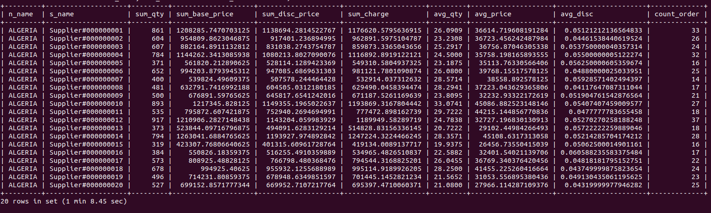
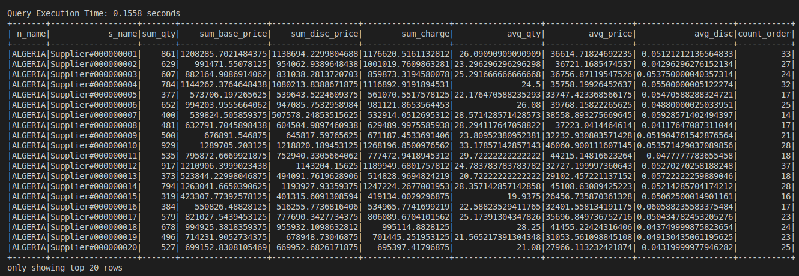

## Problems

1. Use the terminal instead of workbench as it will freeze and force quit
2. If the scale is larger then 1 GB, use these [tricks](https://dhanendranrajagopal.me/technology/mysql/importing-a-huge-32-gb-mysql-dump-faster-tips/) 
    1. Loading the data without PK, FK and indeies and creating them later have actually worked
3. 
4. 
